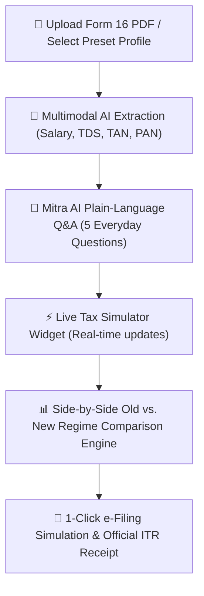

# 🏆 TaxMitra.ai — Conversational AI Income Tax Filing for First-Timers

> **Transforming Indian Income Tax Filing (ITR-1 / ITR-2) into a plain-language, 2-minute conversational experience.**

---

## 📌 Executive Summary

For millions of young professionals, gig workers (delivery partners, tech freelancers), and first-time tax filers in India, filing Income Tax Returns is overwhelming. The process is hampered by confusing tax jargon (e.g., *Section 80C*, *80D*, *HRA exemption u/s 10(13A)*, *Section 87A rebate*), rigid multi-page forms, and uncertainty over whether the **Old Tax Regime** or **New Tax Regime** saves more money.

**TaxMitra.ai** solves this problem using **Conversational AI and Multimodal Document Intelligence**:
1. **Ingests Form 16 PDFs** (or image documents) and automatically extracts salary, employer details, and TDS.
2. **Initiates a 5-question plain-language chat** (e.g., *"Did you pay health insurance for your parents?"*).
3. **Computes real-time tax liabilities** under both Old and New Tax Regimes (FY 2024-25 / AY 2025-26).
4. **Recommends the maximum tax-saving regime** with a side-by-side comparative matrix.
5. **Simulates 1-click e-Filing** with e-Verification (Aadhaar OTP simulation) and downloadable official ITR JSON receipts.

---

## 🔴 The Core Problem

| Challenge | Impact on First-Time Tax Filers |
| :--- | :--- |
| **Complex Tax Jargon** | Terms like *Chapter VI-A*, *Section 80CCD(1B)*, and *80TTA* create fear and confusion. |
| **Old vs. New Regime Dilemma** | Filers don't know which tax regime will yield a lower tax liability or higher tax refund. |
| **Multi-Step Multi-Page Forms** | Official tax portals feature overwhelming drop-downs, numeric grids, and mandatory proof codes. |
| **High Cost of Tax Consultants** | First-timers with simple salaried incomes often pay ₹1,000–₹3,000 to CAs just to file basic returns. |

---

## 🟢 The AI Solution: How TaxMitra.ai Solves It



### 1. Multimodal Form 16 Document Parsing
- Ingests Form 16 Part B PDFs / scans.
- Extracts Gross Salary u/s 17(1), Employer Name & TAN, Employee PAN, HRA exemptions, and Tax Deducted at Source (TDS).
- Includes **3 One-Click Sample Presets** (*Senior Software Engineer ₹12.5L*, *Gig Worker ₹6.8L*, *First-job Professional ₹4.9L*) for instant testing.

### 2. Mitra AI Plain-English Conversational Q&A
Replaces numeric tax forms with 5 human-like questions:
1. **Health Insurance (Sec 80D)**: *"Did you pay health insurance for yourself, your family, or senior citizen parents?"*
2. **House Rent & HRA (Sec 10(13A))**: *"Do you live in a rented house and pay monthly rent?"*
3. **Tax-Saving Investments (Sec 80C)**: *"Did you invest in ELSS mutual funds, PPF, EPF, LIC policies, or tuition fees?"*
4. **Savings Interest (Sec 80TTA)**: *"Did you earn interest from your savings bank accounts?"*
5. **Home Loan (Sec 24(b))**: *"Do you pay interest on a home loan?"*

### 3. Real-Time Live Tax Simulator
As the user answers each question, a dynamic side widget recalculates tax liabilities and shows estimated tax savings in real-time.

### 4. Side-by-Side Old vs. New Regime Matrix
- Aligned with **Indian Income Tax FY 2024-25 / AY 2025-26 Budget Provisions**:
  - **New Regime**: Standard Deduction of **₹75,000** and Section 87A rebate for tax-free income up to **₹7.75 Lakhs** (including Std Deduction).
  - **Old Regime**: Standard Deduction of **₹50,000**, HRA calculation (min of 3 rules), 80C up to ₹1.5L, 80D up to ₹75k, Sec 24 up to ₹2L.
- Provides a **Trophy Badge** highlighting WHICH regime saves maximum money with exact ₹ difference.

### 5. 1-Click e-Filing Simulation & Receipt Generation
- Simulates Aadhaar e-Verification OTP step.
- Generates official e-Filing Acknowledgement (ITR-V style format) with Acknowledgement Number, PAN, Tax Liability, TDS paid, Refund Due / Net Payable, and downloadable ITR JSON.

---

## 🎯 Solved Results & Solved Impact

| Metric | Before TaxMitra.ai | With TaxMitra.ai |
| :--- | :--- | :--- |
| **Filing Time** | 45–60 minutes of tedious manual form filling | **< 2 minutes** conversational chat |
| **Jargon Understanding** | High confusion over 80C, 80D, HRA codes | **0 jargon** (Translated to plain English + built-in Glossary) |
| **Tax Overpayment** | Users often pick wrong regime or miss 80D/HRA deductions | **Guaranteed Minimum Tax** via AI Comparator |
| **User Confidence** | Anxiety & fear of penalty/notices | **100% Confidence** with simulated e-Verification receipt |

---

## 🚀 Why It Wins (Hackathon Jury Pitch)

1. **Massive Market Reach**: Applies to 100M+ Indian taxpayers (salaried employees, gig workers, freelancers).
2. **Solves a Mandatory Government Process**: Unlike optional apps, tax filing is mandatory every single year.
3. **Multimodal LLM Power**: Combines document extraction (OCR/Vision) with conversational Q&A and financial reasoning.
4. **Production-Ready UX**: Modern dark-mode fintech aesthetic built with Next.js 14, Tailwind CSS, and Lucide icons.

---

## 🛠️ Tech Stack

- **Framework**: Next.js 14 (App Router, TypeScript)
- **Styling**: Tailwind CSS, Lucide React Icons
- **Tax Engine**: Custom FY 2024-25 / AY 2025-26 Income Tax Computation Module ([taxEngine.ts](file:///d:/Traffic%20God/src/lib/taxEngine.ts))
- **Document Engine**: Multimodal Form 16 Parser & Extractor ([form16Extractor.ts](file:///d:/Traffic%20God/src/lib/form16Extractor.ts))
- **Chat Engine**: Conversational Q&A & Dynamic Tip Generator ([chatEngine.ts](file:///d:/Traffic%20God/src/lib/chatEngine.ts))

---

## 💻 How to Run Locally

```bash
# 1. Navigate to project folder
cd "d:/Traffic God"

# 2. Install dependencies
npm install

# 3. Run development server
npm run dev
```

Open **[http://localhost:3000](http://localhost:3000)** in your browser to experience **TaxMitra.ai**!
